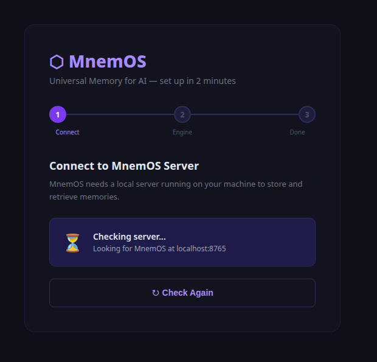
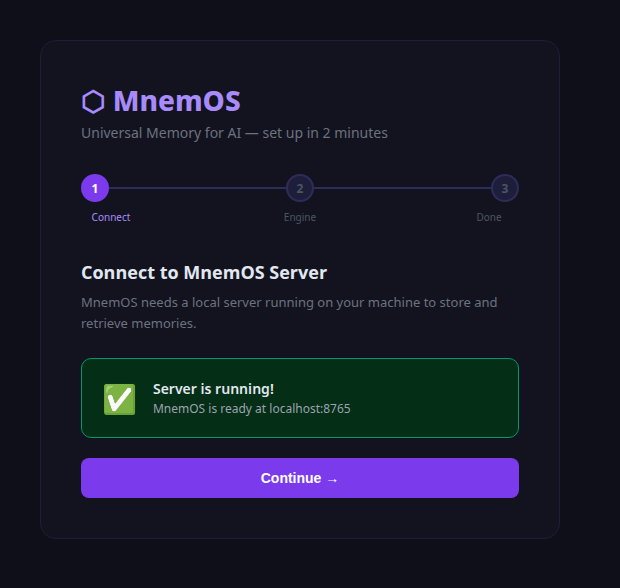
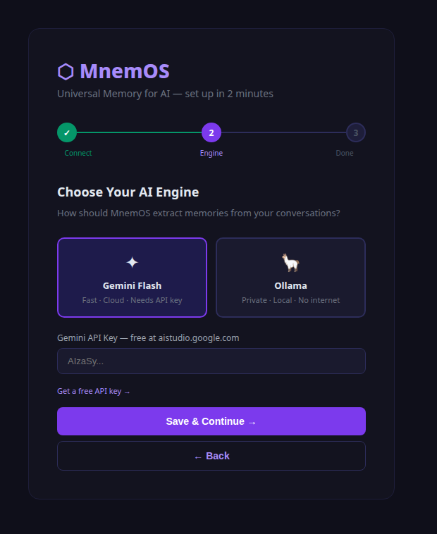
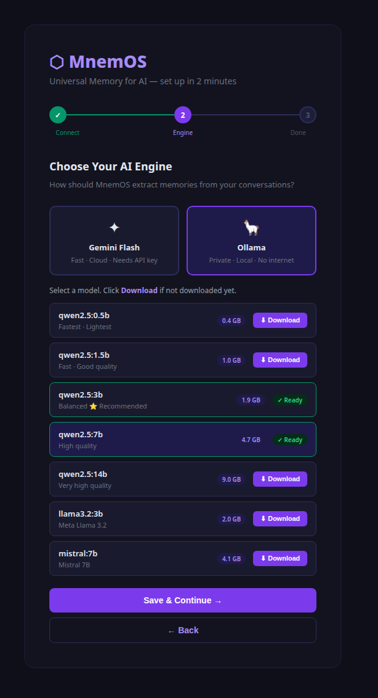
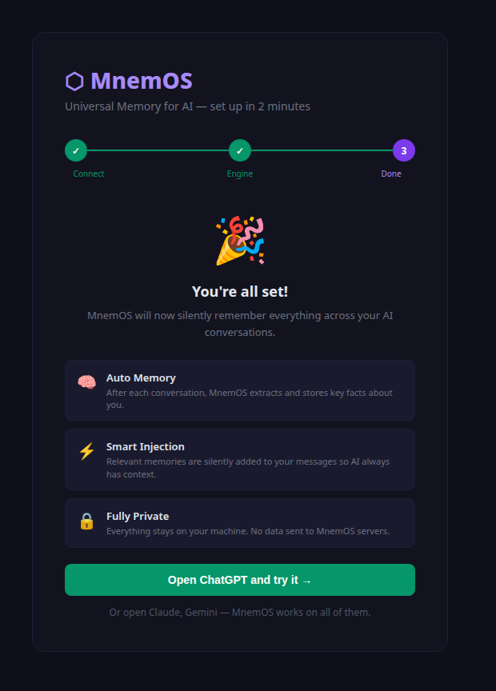
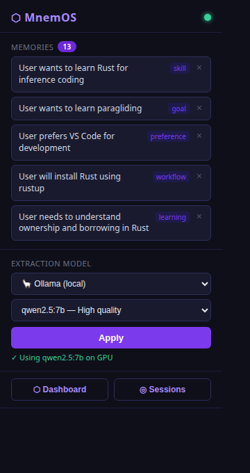
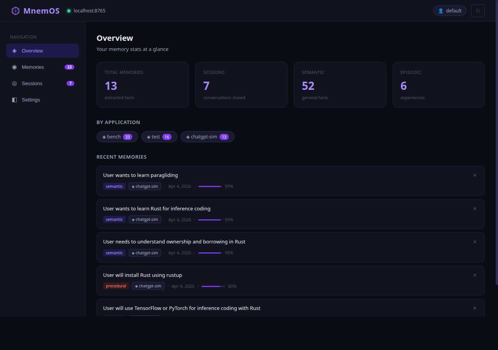
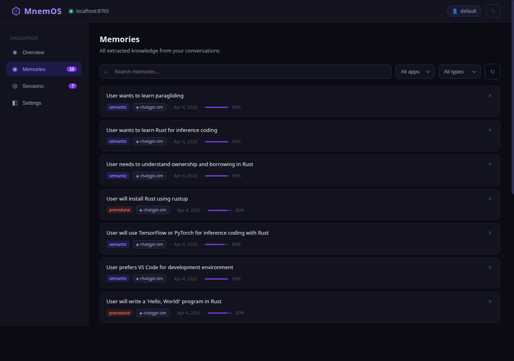
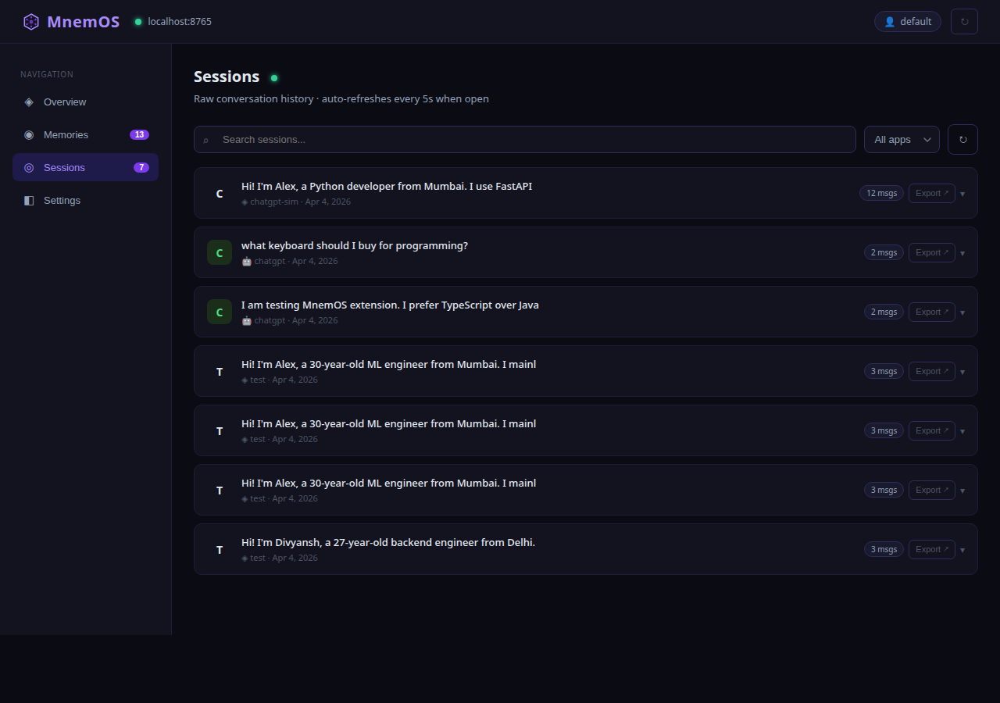
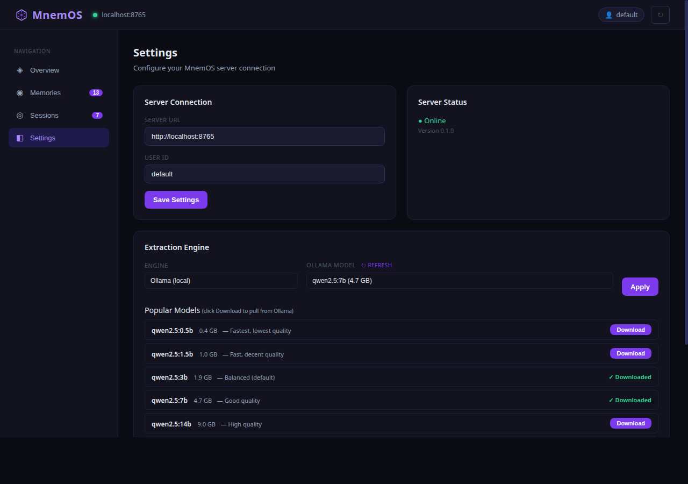

# MnemOS — Screenshots

All images are in `docs/images/`.

---

## Onboarding Flow (first time setup)

**Step 1 — Checking server**

**Step 1 — Server connected**

**Step 2 — Choose engine (Gemini)**

**Step 2 — Choose engine (Ollama + model list)**

**Step 3 — All set**

---

## Extension Popup (daily use)

---

## Dashboard

**Overview**

**Memories tab**

**Sessions tab**

**Settings tab**

